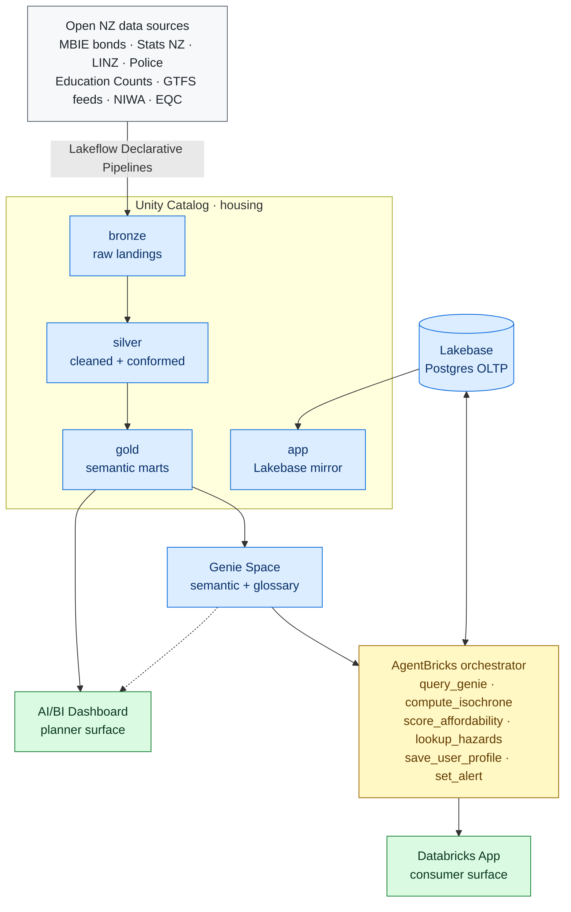

# Architecture

This document describes how Housing Assistant is built end-to-end. It is the canonical reference for design decisions and trade-offs. If something here disagrees with code, update one or the other within the same PR.

## Goals and non-goals

**Goals.**

- Answer real housing-affordability questions for both consumers and planners using a single shared data backbone.
- Be technically defensible: sound modelling, clear lineage, scalable patterns, low cost.
- Be replicable. The architecture should hold up if applied to Australian, Indian, or other open-data jurisdictions later.

**Non-goals.**

- High availability and disaster recovery. Single-region, single-environment is fine.
- Production-grade authentication. Workspace SSO is enough; we do not build a custom auth layer.
- Property-level transaction prices. We use Stats NZ HPI plus council valuations. Sale-by-sale data is behind CoreLogic and is not worth the legal and integration overhead.
- Mobile-first design. A clean web experience is enough.

## High-level diagram

## Layer 1. Lakehouse over open NZ data

**Catalog:** `housing`, with schemas `bronze`, `silver`, `gold`, and `app`.

**Bronze.** One volume per source (`housing.bronze.<source>_files`), keyed by a load timestamp. We never edit bronze. Sources land as their native format (CSV, JSON, GTFS zips, GeoTIFF where applicable). A Lakeflow pipeline parses each source into a typed `housing.bronze.<source>` table.

**Silver.** Cleaned, deduplicated, geocoded. Place names normalised to a canonical `(suburb, territorial_authority, region)` key. Geometries stored as H3 cells at resolution 8 for fast spatial joins. We chose H3 over PostGIS-style polygons because it makes nearest-neighbour and isochrone joins SQL-friendly and cheap on Databricks.

**Gold.** Semantic marts that the Genie semantic layer reads from. Naming follows the project convention: dimension-style tables use the entity name; aggregated tables follow `<entity>__<time_grain>__<breakdowns>`. Initial set:

- `suburb`. Canonical suburb dimension with H3 cells, parent TA and region, demographic snapshot.
- `school`. School dimension with EQI, roll, year levels, location.
- `hazard`. Flood, coastal, liquefaction risk per H3 cell.
- `isochrone`. Pre-computed travel time from H3 origin cell to commercial centres, by mode and minute bucket. This is the table that makes the consumer demo feel fast.
- `rent__month__suburb`. Median rent, p25/p75, dwelling type, sample size.
- `suburb__year`. Census metrics per suburb per census year — income, tenure, rent, crowding, dwelling quality, demographics.
- `area_unit__month`. Recorded-crime victimisations per area unit per month.
- `ta__month` / `ta__quarter`. HUD price, rent, MSD, and affordability indices per territorial authority.

**Pipelines.** All transformations are Lakeflow Declarative Pipelines. We prefer SQL over Python where the transformation is expressible in SQL. Each source has a dedicated pipeline. A top-level "marts" pipeline depends on them and refreshes the gold tables.

## Layer 2. Genie and the semantic layer

The Genie Space wraps the gold catalog with a curated semantic model.

**Synonyms.** "Rent" maps to `rent__month__suburb.median_rent_weekly`, "income" to `suburb__year.median_household_income`. "Decile" includes both school-decile and income-decile concepts, disambiguated by context.

**Joins.** All canonical joins are pre-defined so users do not need to know our schema.

**Glossary.** "Affordable" defaults to *rent below 30% of median household income for the suburb*, with the user's own income overriding this if known. "Within commute distance" defaults to 30 minutes by transit, falling back to drive time if no GTFS feed exists.

The Genie Space is the primary entry point for both the consumer view (via the agent) and the planner view (directly).

## Layer 3. AI agent with tools

We use AgentBricks (Mosaic AI Agent Framework). The agent's job is not to replace Genie. It exists to do the things Genie cannot.

- Disambiguate ambiguous places ("Newton": Auckland or Christchurch?) by asking a clarifying question.
- Combine multiple Genie answers, isochrone lookups, and hazard lookups into a single ranked recommendation.
- Persist the user's constraints in Lakebase and refer back to them in later turns.
- Generate natural-language explanations of why a suburb did or didn't rank.

**Tools the agent can call:**

| Tool | Purpose |
|---|---|
| `query_genie(question)` | Hand a structured question to Genie and get back a result set. |
| `compute_isochrone(origin, mode, minutes)` | Lookup pre-computed isochrones from `housing.gold.isochrone`. |
| `score_affordability(suburb, household_income)` | Apply the affordability rule (rent ≤ 30% income) and return a normalised score. |
| `lookup_hazards(suburb)` | Pull flood / coastal / liquefaction risk for a suburb's H3 cells. |
| `save_user_profile(profile)` | Upsert the user's constraints into Lakebase. |
| `set_alert(query, threshold, channel)` | Register a saved search with a notification rule. |

The agent is invoked from the Databricks App via a Mosaic AI serving endpoint. Conversation history is persisted in Lakebase.

## Layer 4. Lakebase, Databricks App, and AI/BI Dashboard

**Lakebase** is the right home for user state because we need OLTP semantics: read-modify-write per user, low-latency reads on every page load. Lakehouse semantics are wrong for this shape. Schemas:

- `users`. One row per user, basic profile.
- `user_constraints`. The user's current preferences (budget, household size, pets, work location, modes).
- `saved_searches`. Named queries the user wants to come back to.
- `alerts`. Saved searches with notification rules attached.
- `conversation_turns`. Full history of user/agent exchanges, useful for debugging and for re-warming the agent's context.

Lakebase tables are mirrored to the `housing.app` schema in Unity Catalog so Genie and the dashboard can join user data when needed (with appropriate access controls).

**The Databricks App** is the consumer surface: chat-driven, results on a map. The frontend stack is TBD (Streamlit for speed, React + FastAPI for polish). The app authenticates via workspace SSO and calls the agent endpoint and Lakebase directly.

**The AI/BI Dashboard** is the planner surface. It shows national rent-to-income ratios, year-on-year changes by territorial authority, demographic crosscuts, and emergent affordability cliffs. Filters cascade through the dashboard so a planner can drill from "national" to "their council" in three clicks.

## Cross-cutting concerns

**Identity and governance.** Two service principals: one for jobs and pipelines (`sp-housing-jobs`), one for the app (`sp-housing-app`). Catalog grants are coarse-grained in dev. Personally identifiable data does not enter the lakehouse. Lakebase user state is the only place it lives.

**Secrets.** Databricks-backed secret scope `housing-assistant`. API keys for transit feeds and any third-party services live there.

**Observability.** Lakeflow pipelines emit standard event logs. Agent calls log to a `housing.app.agent_traces` table for debugging. The app emits structured logs to stdout (Databricks captures them).

**Scalability.** Every component scales horizontally with no architectural change. The thing that would force a rethink is moving beyond pre-computed isochrones into on-demand routing, which becomes a service-tier decision rather than a Databricks one.

## Open architectural questions

These are unresolved and worth discussing in PR review when relevant:

- Frontend stack (Streamlit vs. React + FastAPI).
- Whether to use Vector Search at all. Current bias: no, until we have a clear RAG use case.
- Whether to expose the Lakebase `users` and `user_constraints` to Genie via UC mirroring, or keep Genie strictly read-only on lakehouse data.
- How to handle the long tail of NZ regions without GTFS feeds. Drive isochrones via OSRM, or distance proxies only.
