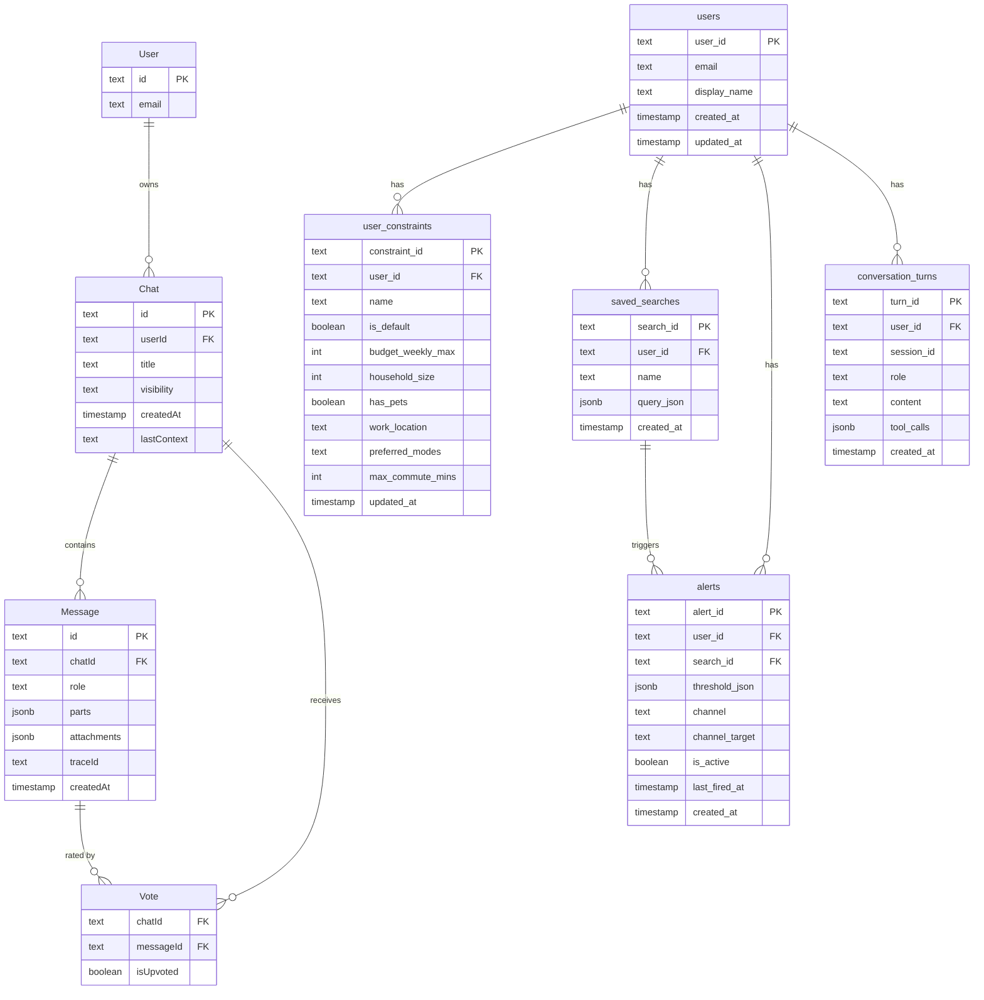

# 05: Database Schema & Migrations

Two separate database systems exist in this project. Knowing which one to use — and how to change it — is essential before writing any data-layer code.

---

## Overview: Two Systems

| | Chat UI (Drizzle) | Housing Domain (Terraform + SQL) |
|---|---|---|
| **Database** | Lakebase (Postgres) | Lakebase (Postgres) |
| **Schema** | `ai_chatbot` | `public` |
| **Migration tool** | Drizzle ORM (`drizzle-kit`) | Terraform + raw SQL |
| **Language** | TypeScript | SQL / HCL |
| **Location** | `e2e-chatbot-app-next/packages/db/` | `terraform/modules/lakebase_migration/` |
| **Who changes it** | Frontend / chat concerns | Housing domain / agent concerns |

---

## System 1: Chat UI — Drizzle ORM

### What it stores

Tables in the `ai_chatbot` Postgres schema:

| Table | Purpose |
|---|---|
| `User` | Registered chat users (id, email) |
| `Chat` | Chat sessions (id, title, userId, visibility, lastContext) |
| `Message` | Individual messages (id, chatId, role, parts, attachments, traceId) |
| `Vote` | Thumbs up/down per message (chatId, messageId, isUpvoted) |

### Key files

| File | Purpose |
|---|---|
| `packages/db/src/schema.ts` | **Source of truth** — Drizzle ORM table definitions |
| `packages/db/src/queries.ts` | Query helpers (saveChat, getChatById, saveMessages, etc.) |
| `packages/db/src/connection.ts` | DB connection setup |
| `packages/db/migrations/` | Applied SQL migration files (auto-generated) |
| `packages/db/migrations/meta/_journal.json` | Drizzle migration journal |
| `drizzle.config.ts` | Drizzle config (dialect, schema path, migrations path) |

### Applied migrations (in order)

| File | What it did |
|---|---|
| `0000_robust_madelyne_pryor.sql` | Created `Chat`, `Message`, `User` tables |
| `0001_add_trace_id.sql` | Added `traceId` column to `Message` (MLflow trace linkage) |
| `0002_polite_red_hulk.sql` | Created `Vote` table |

### How to add a new table (Drizzle)

1. **Edit `schema.ts`** — define your table using Drizzle's schema builder:

```typescript
// packages/db/src/schema.ts
import { pgTable, text, timestamp } from 'drizzle-orm/pg-core';

export const PropertyAlert = pgTable('PropertyAlert', {
  id: text('id').primaryKey().notNull(),
  chatId: text('chatId')
    .notNull()
    .references(() => Chat.id),
  suburb: text('suburb').notNull(),
  createdAt: timestamp('createdAt').notNull(),
});
```

2. **Generate the migration:**

```bash
cd e2e-chatbot-app-next
npx drizzle-kit generate
# Creates packages/db/migrations/000X_<auto-name>.sql
```

3. **Apply the migration:**

```bash
npx drizzle-kit migrate
```

4. **Export from `packages/db/src/index.ts`** if other packages need to import it.

### How to add a column to an existing table

Same flow — edit `schema.ts`, then `drizzle-kit generate` + `drizzle-kit migrate`. Drizzle diffs the schema and generates only the `ALTER TABLE` needed.

### Resetting the database (dev only)

```bash
cd e2e-chatbot-app-next
npx tsx scripts/reset-database.ts
# Drops the ai_chatbot schema and drizzle migration tracking, then re-applies from scratch
```

---

## System 2: Housing Domain — Terraform + Raw SQL

### What it stores

Tables in the `public` Postgres schema:

| Table | Purpose |
|---|---|
| `users` | Registered app users (user_id, email, display_name) |
| `user_constraints` | Preferences per user (budget, household, commute, pets) |
| `saved_searches` | Named search queries with JSONB query params |
| `alerts` | Notification rules tied to searches |
| `conversation_turns` | Full per-session message history (role, content, tool_calls) |

These are described in detail in [`04-lakebase-auth-state.md`](04-lakebase-auth-state.md).

### Key files

| File | Purpose |
|---|---|
| `terraform/modules/lakebase_migration/sql/schema.sql` | **Source of truth** — all `CREATE TABLE IF NOT EXISTS` DDL |
| `terraform/modules/lakebase_migration/main.tf` | Terraform module that executes the SQL against Lakebase |
| `terraform/modules/lakebase_migration/variables.tf` | Input variables (connection string, credentials) |
| `terraform/modules/lakebase_migration/outputs.tf` | Output values |

### How to add a new table (Terraform/SQL)

1. **Edit `sql/schema.sql`** — append your `CREATE TABLE IF NOT EXISTS` statement:

```sql
-- terraform/modules/lakebase_migration/sql/schema.sql

CREATE TABLE IF NOT EXISTS property_listings (
    listing_id  TEXT PRIMARY KEY,
    suburb      TEXT NOT NULL,
    price_weekly INT,
    bedrooms    INT,
    source_url  TEXT,
    scraped_at  TIMESTAMPTZ DEFAULT NOW()
);

CREATE INDEX IF NOT EXISTS idx_property_listings_suburb
    ON property_listings(suburb);
```

2. **Apply via Terraform:**

```bash
cd terraform
terraform plan   # verify what will change
terraform apply
```

Terraform re-executes the SQL file. Because statements use `IF NOT EXISTS`, existing tables are untouched — only new tables/indexes are created.

### How to add a column to an existing table

`CREATE TABLE IF NOT EXISTS` is idempotent but `ALTER TABLE` is not. Add your column in `schema.sql` using a conditional pattern:

```sql
-- safe to re-run
DO $$
BEGIN
    IF NOT EXISTS (
        SELECT 1 FROM information_schema.columns
        WHERE table_name='users' AND column_name='phone'
    ) THEN
        ALTER TABLE users ADD COLUMN phone TEXT;
    END IF;
END $$;
```

Then run `terraform apply`.

---

## Which System to Use

| Scenario | System |
|---|---|
| Storing chat messages, votes, session state | Drizzle (`ai_chatbot` schema) |
| Storing user profiles, search preferences, alerts | Terraform/SQL (`public` schema) |
| Caching property listings or suburb data | Terraform/SQL (`public` schema) |
| Adding a field to the chat UI data model | Drizzle |
| Adding a new housing-domain entity | Terraform/SQL |

---

## ER Diagram (Both Systems)



---

## Connection Details

Both systems connect to Lakebase (Databricks-managed Postgres). Connection config comes from environment variables or Terraform-supplied values:

```
LAKEBASE_HOST       — Postgres hostname
LAKEBASE_USER       — Service principal user
LAKEBASE_PASSWORD   — From Databricks secrets scope
LAKEBASE_DATABASE   — "housing" (domain) or as configured for chat UI
```

See [`04-lakebase-auth-state.md`](04-lakebase-auth-state.md) for the full auth + grants setup.

---

**Author**: Naineel Soyantar | **Last Updated**: 2026-05-14
