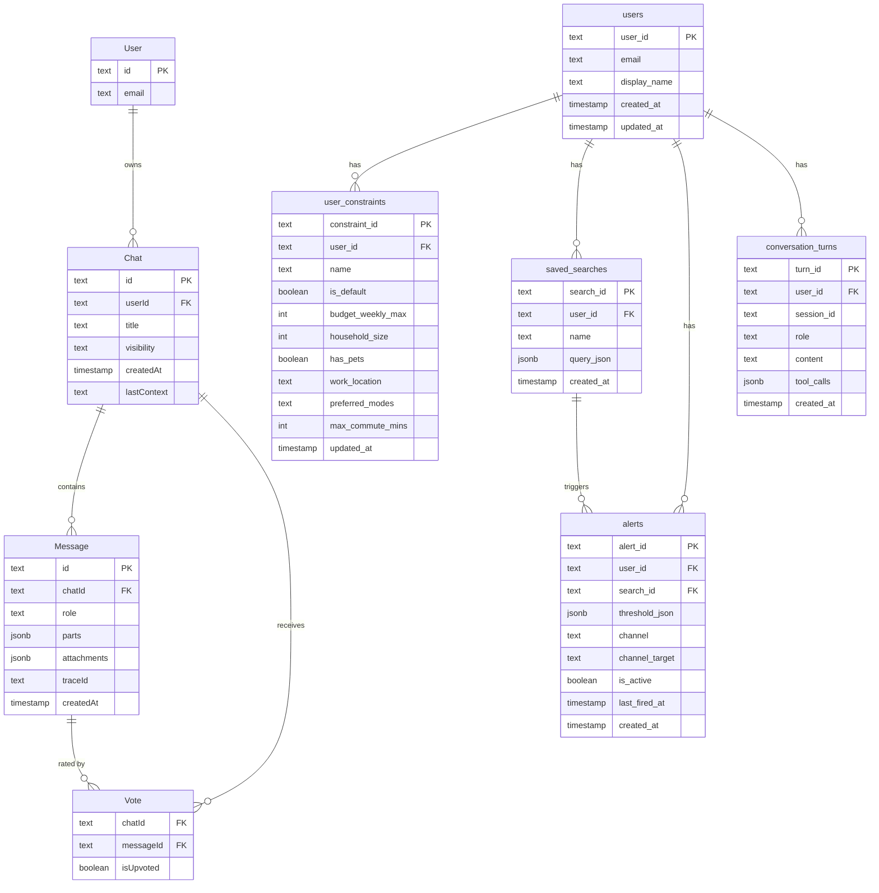

# 05: Database Schema & Migrations

Lakebase schema changes are managed with Drizzle ORM. Knowing which schema to edit — and how to generate/apply migrations — is essential before writing any data-layer code.

---

## Overview: Drizzle-Managed Schemas

| | Chat UI | Housing Domain |
|---|---|---|
| **Database** | Lakebase (Postgres) | Lakebase (Postgres) |
| **Schema** | `ai_chatbot` | `public` |
| **Migration tool** | Drizzle ORM (`drizzle-kit`) | Drizzle ORM (`drizzle-kit`) |
| **Language** | TypeScript | TypeScript |
| **Location** | `e2e-chatbot-app-next/packages/db/src/schema.ts` | `e2e-chatbot-app-next/packages/db/src/schema-housing.ts` |
| **Who changes it** | Frontend / chat concerns | Housing domain / agent concerns |

Terraform provisions Lakebase infrastructure only: project, app service-principal-backed Postgres role, and application database. It does not run schema DDL.

---

## Chat UI — Drizzle ORM

### What it stores

Tables in the `ai_chatbot` Postgres schema:

| Table | Purpose |
|---|---|
| `User` | Registered chat users (id, email) |
| `Chat` | Chat sessions (id, title, userId, visibility, lastContext) |
| `Message` | Individual messages (id, chatId, role, parts, attachments, traceId) |
| `Vote` | Thumbs up/down per message (chatId, messageId, isUpvoted) |

### Key files

| File | Purpose |
|---|---|
| `packages/db/src/schema.ts` | **Source of truth** — Drizzle ORM table definitions |
| `packages/db/src/queries.ts` | Query helpers (saveChat, getChatById, saveMessages, etc.) |
| `packages/db/src/connection.ts` | DB connection setup |
| `packages/db/migrations/` | Applied SQL migration files (auto-generated) |
| `packages/db/migrations/meta/_journal.json` | Drizzle migration journal |
| `drizzle.config.ts` | Drizzle config (dialect, schema path, migrations path) |

### Applied migrations (in order)

| File | What it did |
|---|---|
| `0000_robust_madelyne_pryor.sql` | Created `Chat`, `Message`, `User` tables |
| `0001_add_trace_id.sql` | Added `traceId` column to `Message` (MLflow trace linkage) |
| `0002_polite_red_hulk.sql` | Created `Vote` table |

### How to add a new table (Drizzle)

1. **Edit `schema.ts`** — define your table using Drizzle's schema builder:

```typescript
// packages/db/src/schema.ts
import { pgTable, text, timestamp } from 'drizzle-orm/pg-core';

export const PropertyAlert = pgTable('PropertyAlert', {
  id: text('id').primaryKey().notNull(),
  chatId: text('chatId')
    .notNull()
    .references(() => Chat.id),
  suburb: text('suburb').notNull(),
  createdAt: timestamp('createdAt').notNull(),
});
```

2. **Generate the migration:**

```bash
cd e2e-chatbot-app-next
npx drizzle-kit generate
# Creates packages/db/migrations/000X_<auto-name>.sql
```

3. **Apply the migration:**

```bash
npx drizzle-kit migrate
```

4. **Export from `packages/db/src/index.ts`** if other packages need to import it.

### How to add a column to an existing table

Same flow — edit `schema.ts`, then `drizzle-kit generate` + `drizzle-kit migrate`. Drizzle diffs the schema and generates only the `ALTER TABLE` needed.

### Resetting the database (dev only)

```bash
cd e2e-chatbot-app-next
npx tsx scripts/reset-database.ts
# Drops the ai_chatbot schema and drizzle migration tracking, then re-applies from scratch
```

---

## Housing Domain — Drizzle ORM

### What it stores

Tables in the `public` Postgres schema:

| Table | Purpose |
|---|---|
| `users` | Registered app users (user_id, email, display_name) |
| `user_constraints` | Preferences per user (budget, household, commute, pets) |
| `saved_searches` | Named search queries with JSONB query params |
| `alerts` | Notification rules tied to searches |
| `conversation_turns` | Full per-session message history (role, content, tool_calls) |

These are described in detail in [`04-lakebase-auth-state.md`](04-lakebase-auth-state.md).

### Key files

| File | Purpose |
|---|---|
| `packages/db/src/schema-housing.ts` | **Source of truth** — housing-domain Drizzle table definitions |
| `packages/db/migrations/` | Applied SQL migration files generated by Drizzle |
| `packages/db/migrations/meta/_journal.json` | Drizzle migration journal |
| `drizzle.config.ts` | Drizzle config, including both chat and housing schema files |

### How to add a new table (Drizzle)

1. **Edit `packages/db/src/schema-housing.ts`** — add your Drizzle table definition:

```typescript
import { index, integer, pgTable, text, timestamp } from 'drizzle-orm/pg-core';

export const propertyListings = pgTable(
  'property_listings',
  {
    listing_id: text('listing_id').primaryKey(),
    suburb: text('suburb').notNull(),
    price_weekly: integer('price_weekly'),
    bedrooms: integer('bedrooms'),
    source_url: text('source_url'),
    scraped_at: timestamp('scraped_at', { withTimezone: true }).defaultNow(),
  },
  (table) => [index('idx_property_listings_suburb').on(table.suburb)],
);
```

2. **Generate and apply the migration:**

```bash
cd e2e-chatbot-app-next
npx drizzle-kit generate
npx drizzle-kit migrate
```

### How to add a column to an existing table

Edit `packages/db/src/schema-housing.ts`, then generate and apply a Drizzle migration:

```bash
cd e2e-chatbot-app-next
npx drizzle-kit generate
npx drizzle-kit migrate
```

---

## Which System to Use

| Scenario | System |
|---|---|
| Storing chat messages, votes, session state | Drizzle (`ai_chatbot` schema) |
| Storing user profiles, search preferences, alerts | Drizzle (`public` schema via `schema-housing.ts`) |
| Caching property listings or suburb data | Drizzle (`public` schema via `schema-housing.ts`) |
| Adding a field to the chat UI data model | Drizzle |
| Adding a new housing-domain entity | Drizzle |

---

## ER Diagram (Both Systems)



---

## Connection Details

Both systems connect to Lakebase (Databricks-managed Postgres). Connection config comes from environment variables or Terraform-supplied values:

```
LAKEBASE_HOST       — Postgres hostname
LAKEBASE_USER       — Service principal user
LAKEBASE_PASSWORD   — From Databricks secrets scope
LAKEBASE_DATABASE   — "housing" (domain) or as configured for chat UI
```

See [`04-lakebase-auth-state.md`](04-lakebase-auth-state.md) for the full auth + grants setup.

---

## Adding a Cross-Cutting Feature: Alerts Walkthrough

Alerts touch every layer of the stack. Use this as the canonical example for any feature that needs DB persistence, an API, agent awareness, and a UI surface.

The `alerts` table already exists in the housing-domain schema — no migration needed. The work is wiring it up across all layers.

---

### Layer 1 — Database (housing domain, `public` schema)

**Table already defined in:** `packages/db/src/schema-housing.ts`

```sql
CREATE TABLE IF NOT EXISTS alerts (
  alert_id       TEXT        PRIMARY KEY DEFAULT gen_random_uuid()::TEXT,
  user_id        TEXT        NOT NULL REFERENCES users (user_id) ON DELETE CASCADE,
  search_id      TEXT        REFERENCES saved_searches (search_id) ON DELETE SET NULL,
  threshold_json JSONB,          -- e.g. {"max_rent_weekly": 750}
  channel        TEXT        NOT NULL CHECK (channel IN ('email', 'webhook')),
  channel_target TEXT        NOT NULL,   -- email address or webhook URL
  is_active      BOOLEAN     NOT NULL DEFAULT TRUE,
  last_fired_at  TIMESTAMPTZ,
  created_at     TIMESTAMPTZ NOT NULL DEFAULT now()
);
```

If you need to add a column (e.g. `name TEXT`), update `packages/db/src/schema-housing.ts`, then generate and apply a Drizzle migration.

**No action needed for the alerts table itself.**

---

### Layer 2 — DB Queries layer (TypeScript)

**File:** `e2e-chatbot-app-next/packages/db/src/queries.ts`

Add four functions after the existing `getVotesByChatId()` at line 497, following the same `ensureDb()` + `isDatabaseAvailable()` pattern used by every other function in that file:

```typescript
// After line 497 in queries.ts

export async function saveAlert({
  userId,
  searchId,
  thresholdJson,
  channel,
  channelTarget,
}: {
  userId: string;
  searchId?: string;
  thresholdJson: Record<string, unknown>;
  channel: 'email' | 'webhook';
  channelTarget: string;
}) {
  const db = await ensureDb();
  if (!isDatabaseAvailable(db)) return;
  // INSERT into the housing-domain Lakebase, not the ai_chatbot schema —
  // use the lakebase connection, not the Drizzle db instance here
}

export async function getAlertsByUserId({ userId }: { userId: string }) { ... }
export async function deleteAlertById({ alertId }: { alertId: string }) { ... }
export async function updateAlertById({
  alertId,
  isActive,
  lastFiredAt,
}: {
  alertId: string;
  isActive?: boolean;
  lastFiredAt?: Date;
}) { ... }
```

> **Note:** The `alerts` table lives in the housing-domain Lakebase (System 2), not in the `ai_chatbot` Drizzle schema. These query functions need to use the Lakebase psycopg2/postgres connection, not the Drizzle ORM `db` instance. Use the same Lakebase connection helper already used by `utils_memory.py` on the backend, or create a parallel connection utility in the TS layer.

---

### Layer 3 — API route (Express backend)

**Create new file:** `e2e-chatbot-app-next/server/src/routes/alerts.ts`

Model it after `server/src/routes/feedback.ts` (the closest parallel — it handles per-user state with auth middleware):

```typescript
// server/src/routes/alerts.ts
import { Router } from 'express';
import { authMiddleware, requireAuth } from '../middleware/auth';
import { saveAlert, getAlertsByUserId, deleteAlertById, updateAlertById } from '@repo/db';

const router = Router();
router.use(authMiddleware);

// GET /api/alerts — list all alerts for the current user
router.get('/', requireAuth, async (req, res) => { ... });

// POST /api/alerts — create a new alert
router.post('/', requireAuth, async (req, res) => { ... });

// PATCH /api/alerts/:alertId — toggle active / update threshold
router.patch('/:alertId', requireAuth, async (req, res) => { ... });

// DELETE /api/alerts/:alertId — delete an alert
router.delete('/:alertId', requireAuth, async (req, res) => { ... });

export { router as alertsRouter };
```

**Register the router in:** `server/src/index.ts` at line 59:

```typescript
import { alertsRouter } from './routes/alerts';
// ...
app.use('/api/alerts', alertsRouter);
```

---

### Layer 4 — Backend agent (LangGraph)

**File:** `app/app-templates/agent-langgraph-advanced/agent_server/agent.py`

Add a new `@tool` function and include it in the tool list at line 64:

```python
# agent_server/agent.py

@tool
def create_alert(
    threshold_json: dict,
    channel: str,
    channel_target: str,
    search_id: str | None = None,
) -> str:
    """
    Save a housing alert for the current user. Call this when the user says
    'notify me when', 'alert me if', or 'let me know when rent drops below X'.

    Args:
        threshold_json: Conditions to trigger the alert, e.g. {"max_rent_weekly": 700}
        channel: Delivery channel — "email" or "webhook"
        channel_target: Email address or webhook URL
        search_id: Optional — link to an existing saved search
    """
    # Call the housing-domain Lakebase via psycopg2 to INSERT into alerts
    ...
    return f"Alert set. You'll be notified via {channel} when conditions are met."


@tool
def list_alerts() -> str:
    """Return the current user's active alerts."""
    ...


# Line 64 — update the tool list:
tools = [get_current_time, create_alert, list_alerts] + memory_tools()
```

**File:** `app/app-templates/agent-langgraph-advanced/agent_server/prompts.py`

Append to `SYSTEM_PROMPT` to tell the agent when to invoke the alert tools:

```python
SYSTEM_PROMPT = """
...existing prompt...

## Alerts
When the user expresses a desire to be notified about housing conditions (e.g. "tell me
if rent drops", "alert me when a 3-bedroom under $700 appears"), call `create_alert`
with the relevant threshold and their preferred channel. Always confirm the channel_target
(email or webhook URL) before creating the alert. Call `list_alerts` if the user asks
to see their existing alerts.
"""
```

---

### Layer 5 — Frontend UI

Two surfaces to add:

**1. Sidebar alerts panel** — `e2e-chatbot-app-next/client/src/components/app-sidebar.tsx`

The sidebar already has a chat history section (lines 97–101). Add an "Alerts" section below it following the same pattern:

```tsx
// app-sidebar.tsx — after the existing chat history section
<SidebarGroup>
  <SidebarGroupLabel>Alerts</SidebarGroupLabel>
  <AlertsList />   {/* new component — fetches GET /api/alerts */}
</SidebarGroup>
```

**2. "Create alert" action on messages** — `e2e-chatbot-app-next/client/src/components/message-actions.tsx`

Lines 15–196 show the existing copy/feedback buttons. Add a bell icon button that opens an alert creation dialog:

```tsx
// message-actions.tsx — add alongside existing action buttons
<Button variant="ghost" size="icon" onClick={() => setAlertDialogOpen(true)}>
  <BellIcon />
</Button>
<AlertDialog open={alertDialogOpen} onOpenChange={setAlertDialogOpen}>
  {/* form: threshold, channel, channel_target → POST /api/alerts */}
</AlertDialog>
```

The `AlertDialog` Radix primitive is already imported in the codebase (`components/ui/alert-dialog.tsx`) — no new dependency needed.

---

### Complete checklist

```
DB schema
  [ ] alerts table already exists — no migration needed
  [ ] Add column if needed in schema-housing.ts, then generate/apply a Drizzle migration

DB queries (packages/db/src/queries.ts)
  [ ] saveAlert()
  [ ] getAlertsByUserId()
  [ ] deleteAlertById()
  [ ] updateAlertById()

API routes
  [ ] Create server/src/routes/alerts.ts
  [ ] Register in server/src/index.ts (line 59)

Agent
  [ ] Add create_alert @tool to agent_server/agent.py (line 64)
  [ ] Add list_alerts @tool to agent_server/agent.py (line 64)
  [ ] Update SYSTEM_PROMPT in agent_server/prompts.py

Frontend
  [ ] AlertsList component — fetches GET /api/alerts, renders in sidebar
  [ ] Alert creation dialog — triggered from message-actions.tsx, POSTs to /api/alerts
  [ ] Alert toggle/delete — PATCH / DELETE from the sidebar list
```

---

**Author**: Naineel Soyantar | **Last Updated**: 2026-05-14
